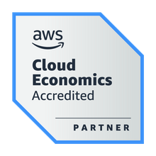
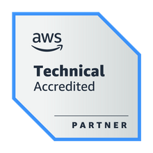

### Hello 👋 I'm Natalya Kim

I'm a full stack developer with 8 years of experience, working with AWS services like Bedrock, Polly, Textract, DynamoDB, and S3. I focus on LLM integration into projects.

### :hammer_and_wrench: Languages and Tools :
Frontend

 
   
  
  

  
Backend

  
  
   
   
  

## Certifications 🎓

